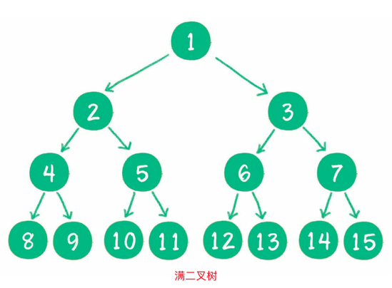
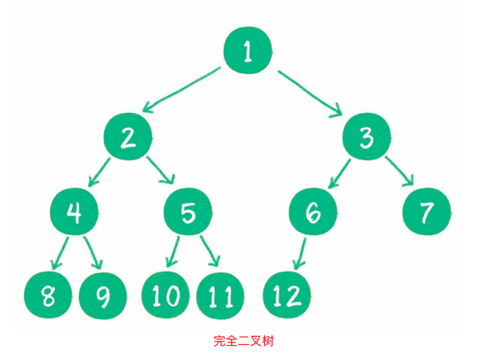
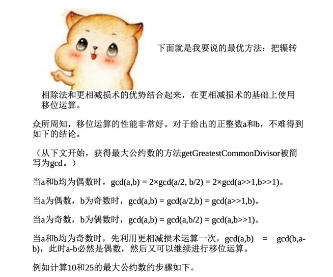

# 小灰的算法之旅

## 数据结构

### 线性结构
#### 数组
  数组是由有限个相同类型的变量所组成的有序集合，它的物理存储方式 是顺序存储，访问方式是随机访问。
  利用下标查找数组元素的时间复杂 度是O(1)，中间插入、删除数组元素的时间复杂度是O(n)。

#### 链表
  链表是一种链式数据结构，由若干节点组成，每个节点包含指向下一节 点的指针。链表的物理存储方式是随机存储，访问方式是顺序访问。
  查找链表节点的时间复杂度是O(n)，中间插入、删除节点的时间复杂度是 O(1)。

#### 栈
  栈是一种线性逻辑结构，可以用数组实现，也可以用链表实现。栈包含入栈和出栈操作，遵循先入后出的原则(FILO)。

#### 队列
队列也是一种线性逻辑结构，可以用数组实现，也可以用链表实现。队列包含入队和出队操作，遵循先入先出的原则(FIFO)。
队列和循环队列p92-p94

其他：双端队列，优先级队列
不过优先级队列不属于线性结构，基于二叉堆实现。

#### 哈希表 
    散列表也叫哈希表，是存储Key-Value映射的集合。对于某一个Key，散 列表可以在接近O(1)的时间内进行读写操作。
    散列表通过哈希函数实现 Key和数组下标的转换，通过开放寻址法和链表法来解决哈希冲突。
    组成：数组+链表；是一种非常重要的数据结构；
    JDK8之后，哈希表的链表使用红黑树来组织 => 学习一下红黑树

### 树
是逻辑结构，典型的非线性结构，如族谱图和企业职级图；
#### 二叉树
- 满二叉树
  一个二叉树的所有非叶子节点都存在左右孩子，并且所有叶子节点都在同一层级上，那么这个树就是满二叉树。
  
- 完全二叉树 
  对一个有n个节点的二叉树，按层级顺序编号，则所有节点的编号为从1 到n。如果这个树所有节点和同样深度的满二叉树的编号为从1到n的节 点位置相同，则这个二叉树为完全二叉树。
  
- 链式存储是二叉树最直观的存储方式
  
完全二叉树的条件没有满二叉树那么苛刻:满二叉树要求所有分支都是
  满的;而完全二叉树只需保证最后一个节点之前的节点都齐全即可。
数组也可以用来存储二叉树，假设一个父节点的下标是parent，那么它的左孩子节点下标就 是2×parent + 1 ;右孩子节点下标就是2×parent + 2 。
反过来，假设一个左孩子节点的下标是leftChild，那么它的父节点下标 就是(leftChild-1)/ 2 。
对于一个稀疏的二叉树来说，用数组表示法是非常浪费空间的。
什么样的二叉树最适合用数组表示呢? 二叉堆，一种特殊的完全二叉树，就是用数组来存储的。

二叉查找树，二叉排序树
二叉树的自平衡：红黑树、AVL树、树堆

- 二叉树的遍历
  按节点位置关系遍历 => 遍历算法p140-p143（递归+非递归栈遍历）
  - 前序遍历 => 二叉树的前序遍历，输出顺序是根节点、左子树、右子树。
  - 中序遍历 => 二叉树的中序遍历，输出顺序是左子树、根节点、右子树。
  - 后序遍历 => 二叉树的后序遍历，输出顺序是左子树、右子树、根节点。
  - 层序遍历 => 二叉树按照从根节点到叶子节点的层次关系，一层一层横向遍历各个节点。 
  遍历步骤：使用队列的数据结构来遍历，1. 构造一个队列，先把根节点压入队列；2. 然后循环判断该队列是否为空；3. 不为空从队列中取出元素，打印该元素；4. 如果左节点不为空，压入左节点；5. 如果右节点不为空，压入右节点；然后循环2-5的步骤；
更宏观的角度分
   - 深度优先遍历(前序遍历、中序遍历、后序遍历)
   - 广度优先遍历(层序遍历)

#### 多叉树
略
#### 二叉堆
本质上是一种完全二叉树，有最大堆和最小堆。最大堆：任何一个父节点的值，都大于或等于他左、右孩子节点的值；反过来，最小堆则是任何一个父节点的值，都小于等于他左、右孩子节点的值；
二叉堆的根节点叫堆顶。最大堆和最小堆的特点决定了:最大堆的堆顶是整个堆中的最大元素 ;最小堆的堆顶是整个堆中的最小元素 。
#### 多叉堆

### 图

### 其他
- 跳表
- 哈希链表
- 位图

## 算法的好坏
### 时间复杂度

O(nlogn)、O(n^3 )、O(mn)、O(2^n )、O(n!)
### 空间复杂度
大O表示法

## 排序算法

### 类型
- 复杂度O(n^2)
冒泡排序
选择排序
插入排序
- 复杂度O(nlogn)
快速排序
归并排序
堆排序
- 复杂度O(n)
计数排序
桶排序
基数排序

还能根据其稳定性，分为稳定排序和不稳定排序

## 算法

### 求两数的最大公约数
[golang](./getGreatestCommonDivisor.go)
 

