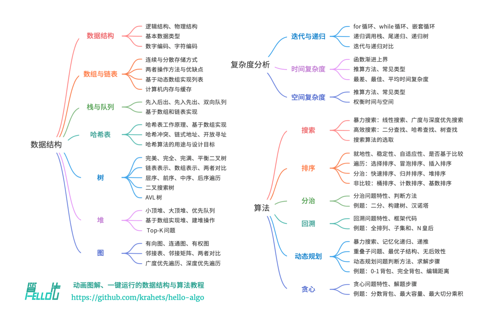

# Hello-Algo
[图书地址](https://www.hello-algo.com/chapter_preface/about_the_book/#012)

[Github仓库](https://github.com/krahets/hello-algo)

## 第一章 初识算法
### 算法无处不在
* 查字典 - 二分查找
* 打扑克(整理手牌) - 插入排序
* 商铺找零 - 贪心算法

### 数据结构和算法的关系
* 数据结构是算法的基石
* 算法是数据结构发挥作用的舞台
* 算法通常可以基于不同数据结构实现，但是执行效率可能会差距很大，所以选择合适的数据结构很关键

## 第二章 复杂度分析

### 算法效率评估
目标： 1. 找到问题解法  2. 寻求最优解

所以在能解决问题的前提下，算法效率成为评估算法优劣的指标；
通常有两个维度：时间效率和空间效率

* 实际测试
  * 难以排除测试环境的干扰因素
  * 展开完整测试非常消耗资源
* 理论估算
  * 时间复杂度分析
  * 空间复杂度分析

### 迭代与递归
重复执行的任务，可使用迭代和递归实现

* 迭代：自下而上解决问题，从最基础的步骤开始，不断累加，直到任务完成。
  * for循环 - 提前知道循环次数
  * while循环 - 更灵活，不满足条件退出即可
  * 嵌套循环(双重)
* 递归：自上而下解决问题，将问题分解成更小的问题
一种算法策略，通过调用自身来解决问题
  * 递：程序不断深入调用自身，通常传入更小或更简化的参数，直到达到终止条件；
  * 归：触发终止条件后，程序从最深层的递归函数开始逐层返回结果
  * 递归三要素
    * 终止条件：决定何时由递转归；
    * 递归调用：对应递，函数调用自身，通常转入更小的参数；
    * 返回结果：对应归，将当前层级的结果返回至上级；
  * 不过递归比迭代更加耗费内存空间，因为涉及到函数调用，系统分配系统调用栈。
  * 适用于子问题分解，如树、图、分治、回溯等，代码结构简洁、清晰；如搜索、排序、回溯、分治、动态规划等许多重要算法策略直接或间接地应用了这种思维方式。

### 时间复杂度

