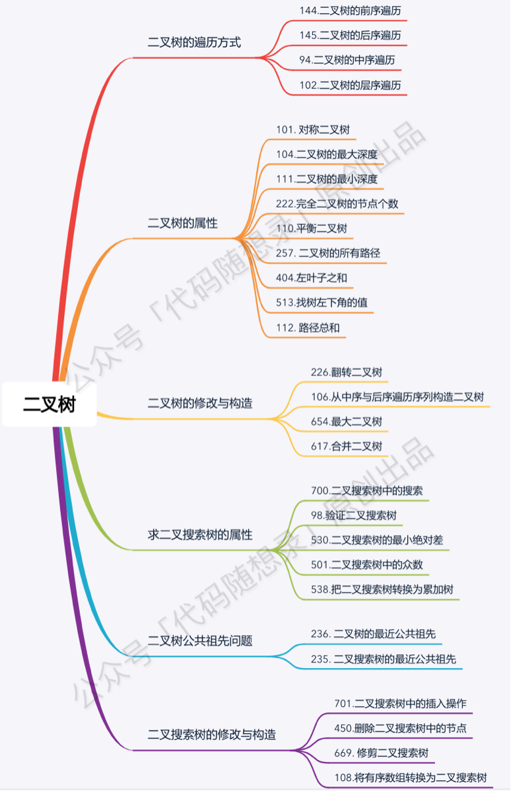

# 算法

## 滑动窗口
1. 最长子字符串

   滑动窗口的思想：两个指针+hash表；俩起始位置都相同，然后快指针每走过一个元素，尝试把元素加到hash表中，
   如果不存在则添加到hash表，如果存在，则从慢指针开始依次删，删一个再尝试加一个，直到加入成功，继续走快指针；

## 数组的原地hash
1. [41题](./hard/firstMissingPositive.go)

## 链表题目
力扣链表刷题总结

| 题目                  | 剑指offer/其他 | 难度 | 难点                  |
|---------------------|------------|----|---------------------|
| 剑指06. 从尾到头打印链表      | 剑指offer06  | 简单 | 难点                  |
| 206.反转链表            | 剑指offer24  | 简单 | 难点                  |
| 92.反转链表II           |            | 中等 | 难点                  |
| 剑指 22. 链表中倒数第k个节点   | 剑指22       | 简单 | 利用快慢指针              |
| 19. 删除链表的倒数第 N 个结点  | 剑指21       | 中等 |                     |
| 876. 链表的中间结点        |            | 简单 | 定位中间节点              |
| 141. 环形链表           |            | 简单 |                     |
| 142. 环形链表 II        | 剑指022      | 中等 | 快慢指针算法公式推到          |
| 160. 相交链表           | 剑指52       | 简单 | 双指针降低空间复杂度          |
| 21. 合并两个有序链表        | 剑指25       | 简单 |                     |
| 23. 合并 K 个升序链表      | 剑指078      | 困难 | 利用数据结构，降低时间复杂度      |
| 86. 分隔链表            |            | 中等 |                     |
| 剑指Offer 35. 复杂链表的复制 | 剑指35       | 中等 | 仅用O(1)空间            |
| 234. 回文链表           |            | 简单 |                     |
| 25. K 个一组翻转链表       |            | 困难 | 仅用O(1)额外空间          |
| 148. 排序链表           |            | 中等 | 主要把快排和归并排序的递归写熟练就好了 |

翻转链表题：
206.反转链表
92.反转链表II
25.翻转K个链表

## 二叉树
二叉树的题目，按照如下顺序刷力扣上的题目，相信会帮你在学习二叉树的路上少走很多弯路。以下每道题目在力扣题解区都有「代码随想录」的题解。

《代码随想录》算法视频公开课：讲透二叉树的层序遍历 | 广度优先搜索 | LeetCode：102.二叉树的层序遍历，相信结合视频在看本篇题解，更有助于大家对本题的理解。
学会二叉树的层序遍历，可以一口气打完以下十题：

* 102.二叉树的层序遍历
* 107.二叉树的层次遍历II
* 199.二叉树的右视图
* 637.二叉树的层平均值
* 429.N叉树的前序遍历
* 515.在每个树行中找最大值
* 116.填充每个节点的下一个右侧节点指针
* 117.填充每个节点的下一个右侧节点指针II
* 104.二叉树的最大深度
* 111.二叉树的最小深度
