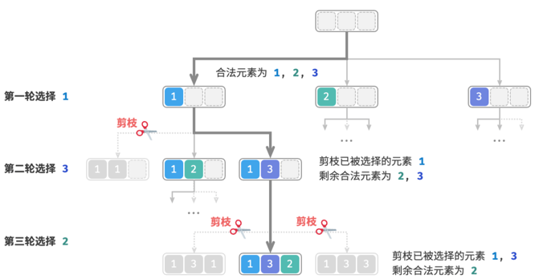

## 回溯算法

1. 定义：回溯算法（backtracking algorithm）是一种通过穷举来解决问题的方法，它的核心思想是从一个初始状态出发，暴力搜索所有可能的解决方案，当遇到正确的解则将其记录，直到找到解或者尝试了所有可能的选择都无法找到解为止。
2. 尝试与回退：之所以称之为回溯算法，是因为该算法在搜索解空间时会采用“尝试”与“回退”的策略。当算法在搜索过程中遇到某个状态无法继续前进或无法得到满足条件的解时，它会撤销上一步的选择，退回到之前的状态，并尝试其他可能的选择。

对于例题一，访问每个节点都代表一次“尝试”，而越过叶节点或返回父节点的 return 则表示“回退”。

值得说明的是，回退并不仅仅包括函数返回。

3. 剪枝
   复杂的回溯问题通常包含一个或多个约束条件，约束条件通常可用于“剪枝”。


## 优缺点
回溯算法本质上是一种深度优先搜索算法，它尝试所有可能的解决方案直到找到满足条件的解。这种方法的优点在于能够找到所有可能的解决方案，而且在合理的剪枝操作下，具有很高的效率。

然而，在处理**大规模或者复杂问题**时，回溯算法的运行效率可能难以接受。

* 时间：回溯算法通常需要遍历状态空间的所有可能，时间复杂度可以达到指数阶或阶乘阶。
* 空间：在递归调用中需要保存当前的状态（例如路径、用于剪枝的辅助变量等），当深度很大时，空间需求可能会变得很大。
即便如此，回溯算法仍然是某些搜索问题和约束满足问题的最佳解决方案。对于这些问题，由于无法预测哪些选择可生成有效的解，因此我们必须对所有可能的选择进行遍历。在这种情况下，关键是如何优化效率，常见的效率优化方法有两种。
* 剪枝：避免搜索那些肯定不会产生解的路径，从而节省时间和空间。
* 启发式搜索：在搜索过程中引入一些策略或者估计值，从而优先搜索最有可能产生有效解的路径

## 回溯典型例题
回溯算法可用于解决许多搜索问题、约束满足问题和组合优化问题。

* 搜索问题：这类问题的目标是找到满足特定条件的解决方案。 
  * 全排列问题：给定一个集合，求出其所有可能的排列组合。
  * 子集和问题：给定一个集合和一个目标和，找到集合中所有和为目标和的子集。
  * 汉诺塔问题：给定三根柱子和一系列大小不同的圆盘，要求将所有圆盘从一根柱子移动到另一根柱子，每次只能移动一个圆盘，且不能将大圆盘放在小圆盘上。
* 约束满足问题：这类问题的目标是找到满足所有约束条件的解。 
  * N皇后：在NxN的棋盘上放置N个皇后，使得它们互不攻击。
  * 数独：在NxN的网格中填入数字1~9 ，使得每行、每列和每个子网格中的数字不重复。
  * 图着色问题：给定一个无向图，用最少的颜色给图的每个顶点着色，使得相邻顶点颜色不同。

* 组合优化问题：这类问题的目标是在一个组合空间中找到满足某些条件的最优解。
  * 0-1 背包问题：给定一组物品和一个背包，每个物品有一定的价值和重量，要求在背包容量限制内，选择物品使得总价值最大。
  * 旅行商问题：在一个图中，从一个点出发，访问所有其他点恰好一次后返回起点，求最短路径。
  * 最大团问题：给定一个无向图，找到最大的完全子图，即子图中的任意两个顶点之间都有边相连。

>> 请注意，对于许多组合优化问题，回溯不是最优解决方案。
> 0-1 背包问题通常使用动态规划解决，以达到更高的时间效率。
> 旅行商是一个著名的 NP-Hard 问题，常用解法有遗传算法和蚁群算法等。
> 最大团问题是图论中的一个经典问题，可用贪心算法等启发式算法来解决。

### 全排列问题
无相等元素的情况
输入一个整数数组，其中不包含重复元素，返回所有可能的排列。



### 模板
```cpp
void backtracking(参数) {
    if (终止条件) {
        存放结果;
        return;
    }

    for (选择：本层集合中元素（树中节点孩子的数量就是集合的大小）) {
        处理节点;
        backtracking(路径，选择列表); // 递归
        回溯，撤销处理结果
    }
}
```

```go
func backtracking(参数) {
    if 终止条件 {
        存放结果
        return
    }

	// 当然，有些比较好判断的终止条件，可以提前判断
    for 选择: range 本层集合中元素(树中节点孩子的数量就是集合的大小) {
        处理节点
        backtracking(路径, 选择列表); // 递归
        回溯, 撤销处理结果
    }
}
```