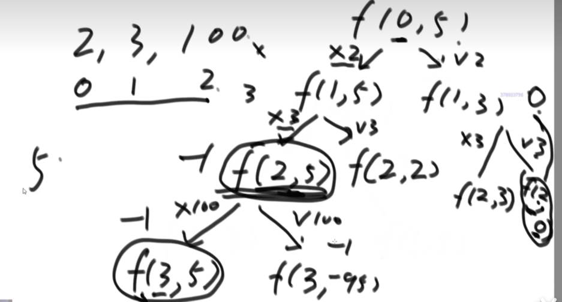

## 动态规划问题

动态规划最主要的问题是找到状态转移方程

* 爬楼梯 -[ 对动态规划解法中状态转移方程f(n) = f(n-1) + f(n-2)的理解](https://blog.csdn.net/fengzheng1232/article/details/127628014)
    首先，明确两点：
    (1)爬楼梯过程中只能迈一步或者迈两步。
    (2)所求为到达n阶台阶走法的方法数，而不是到达n阶台阶的步数。
    那么可推理得：
    当n=1时，只有一种走法：迈一步（1)；
    当=2时，有两种走法：迈一步再迈一步（1+1)、直接迈两步（2)；
    当=3时，有三种走法：迈一步再迈一步再迈一步（1+1+1)、迈一步再迈两步（1+2)、迈两步再迈一步（2+1)；
    当=4时，有五种走法：1+1+2、2+2、1+1+1+1、1+2+1、2+1+1

    这是直观推理，推理到这，有人可能从规律能得出f(n)=fn-1)+fn-2);但还可深度挖掘一下规律的内在逻辑。
    为什么n阶台阶的方法数等于n-1阶台阶方法数加上n-2阶的方法数？
    这里举例子来理解，以=4为例，在迈向第4阶之前一状态的位置，应该在第几阶？从上述明确中第(1)点中，很明显看出要么在第2
    阶，要么在第3阶，不可能在第1阶，因为从第1阶最多只能迈两步长到第3阶。所以第4阶的状态是由前两阶的状态决定的。
    那么第4阶和前两阶的状态有什么关系？
    (1)当第4阶的前一状态在第3阶
    当第4阶的前一状态在第3阶时，到达第4阶只能从第3阶迈一步长到第4阶，那到达第3阶有几种方法：3)=3种方法。到达第3阶后，
    只能走一步长到第4阶，所以无论哪种方法到第3阶，都只能再走一步长，即第3阶到第4阶只有1种走法。
    所以，如果到达第4阶台阶前的停留台阶在第3阶的话，就有f(3)=3种方法可以到达第4阶，即上述红色数字的3种走法（1+1+1+1、1+2+1、2+1+1），最后一步只能
    走一步长。
    (2)第4阶的前一状态在第2阶
    第4阶的前一状态在第2阶时，则只能从第2阶迈两步长到第4阶。
    这里可能有人会有疑问？为什么只能从第2阶迈两步长到第4阶，不能迈一步长到3台阶再迈一步长到第4台阶。原因是，重点理解什
    么叫第4阶的前一状态，迈一步长到3台阶再迈一步长到第4台阶，实际上经历了两个状态，而这种情况，是属于第4阶的前一状态在第3阶
    的情况。
    所以，前一状态在第2阶时，也只有1种走法到第4阶。而到第2阶时，已经有f(2)=2种走法（1+1+2、2+2），那到第4阶的走法就有上述蓝色数字的2
    种走法。
    那么，第4阶的总方法数=第2阶的方法数+第3阶的方法数；（对应上面带色数字）
    以此类推，所以f(n)=f(n-1)+f(n-2)。

* [自拟题目](./minCoins.go)：找凑出钱的最小硬币数量
    递归图解
    
* 

    