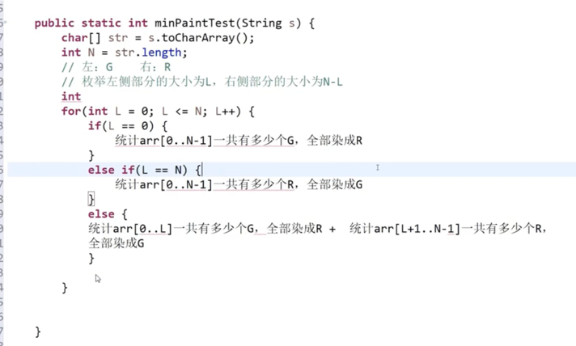
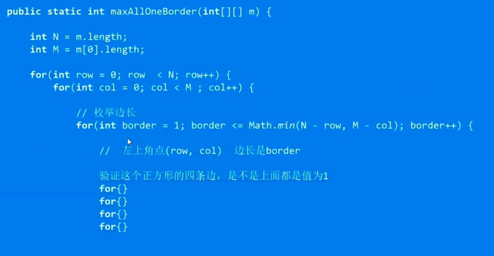

# 左程云的算法课

### 基础

#### 异或操作

位运算的题目

137. 只出现一次的数字 II	LeetCode 题解链接	中等	🤩🤩🤩
190. 颠倒二进制位	LeetCode 题解链接	简单	🤩🤩🤩
191. 位1的个数	LeetCode 题解链接	简单	🤩🤩🤩
231. 2 的幂	LeetCode 题解链接	简单	🤩🤩🤩
260. 只出现一次的数字 III	LeetCode 题解链接	中等	🤩🤩🤩🤩
268. 丢失的数字	LeetCode 题解链接	简单	🤩🤩🤩🤩
338. 比特位计数	LeetCode 题解链接	简单	🤩🤩🤩
342. 4的幂	LeetCode 题解链接	简单	🤩🤩🤩
371. 两整数之和	LeetCode 题解链接	中等	🤩🤩🤩🤩
405. 数字转换为十六进制数	LeetCode 题解链接	简单	🤩🤩🤩🤩
461. 汉明距离	LeetCode 题解链接	简单	🤩🤩🤩🤩
476. 数字的补数	LeetCode 题解链接	简单	🤩🤩🤩🤩
477. 汉明距离总和	LeetCode 题解链接	简单	🤩🤩🤩🤩
526. 优美的排列	LeetCode 题解链接	中等	🤩🤩🤩
1178. 猜字谜	LeetCode 题解链接	困难	🤩🤩🤩🤩
1711. 大餐计数	LeetCode 题解链接	中等	🤩🤩🤩
剑指 Offer 15. 二进制中1的个数	LeetCode 题解链接	简单	🤩🤩🤩

### 中级

* [滑动窗口][绳子最大覆盖点位数量]
  (./slidingWindow/rope.go)：给定一个有序数组arr，代表数轴上从左到右有n个点arr[0]、arr[1]...arr[n-1]，给定一个正数L,代表一根长度为L的绳子,求绳子最多能覆盖其中的几个点。
* [购买苹果需要带子的最小数量](./minBagNumber.go)
  小虎去附近的商店买苹果，奸诈的商贩使用了捆绑交易，只提供6个每袋和8个每袋的包装包装不可拆分。可是小虎现在只想购买恰好N个苹果，小虎想购买尽量少的袋数方便携带。
如果不能购买恰好N个苹果，小虎将不会购买。输入一个整数N，表示小虎想购买的个苹果，返回最小使用多少袋子。如果无论如何都不能正好装下，返回-1。
* [最小染色](./minPaint.go)牛牛有一些排成一行的正方形。每个正方形已经被染成红色或者绿色。牛牛现在可以选择任意一个正方形然后用这两种颜色的任意一种进行染色，这个正方形的颜色将
  会被覆盖。牛牛的目标是在完成染色之后，每个红色R都比每个绿色G距离最左侧近。牛牛想知道他最少需要涂染几个正方形。如样例所示：s=RGRGR我们涂染之后变成RRRGG满足要求了，涂染的个数为2，没有比这个更好的涂染方案。
  
* [1139-最大正方形]()给你一个由若干 0 和 1 组成的二维网格 grid，请你找出边界全部由 1 组成的最大 正方形 子网格，并返回该子网格中的元素数量。如果不存在，则返回 0。
  